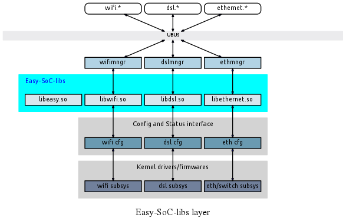

# Easy SoC Libraries

`easy-soc-libs` is a collection of shared libraries, which provide a platform's
subsystem abstraction through well defined APIs.

Presently, the package provides libraries for **WiFi**, **DSL** and **Ethernet**. 

It also contains one helper library that include APIs for common system functions.

## Architecture

For more information about a specific library, please refer to that library's API
header file.

**Table 1. subsystem and libraries** 

Subsystem | Library name| API header file
------|-----------|------------
**DSL** | libdsl.so | *xdsl.h*
||
**WiFi** | libwifi-6.so | *wifi.h*
||
**Ethernet** | libethernet.so | *ethernet.h*

The common helper library is called `libeasy.so`, and its header file is *easy.h*.
Applications wanting to use this helper library must include *"easy/easy.h"*.

---
